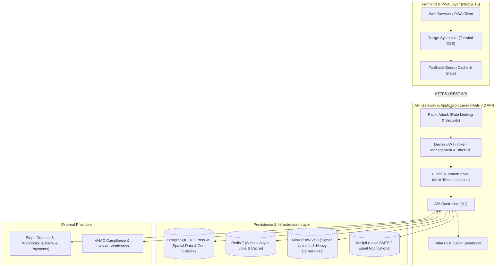

<div align="center">

# 🛰️ DroneHub / OEST SaaS Platform
### Enterprise Marketplace & Mission Operating System for Aerial Services & Geospatial Data

[](https://github.com/MrGr33n98/ab01-saas-oest/actions/workflows/ci.yml)
[](LICENSE)
[-black?logo=next.js)](https://nextjs.org/)
[](https://rubyonrails.org/)
[](https://postgis.net/)
[](https://www.typescriptlang.org/)
[](https://tailwindcss.com/)
[](docker-compose.yml)
[](docs/product/PRD.md)

<p align="center">
  <b>DroneHub</b> é a plataforma operacional e marketplace corporativo de alta precisão que conecta a demanda empresarial, operadores de drones homologados e produtos de dados geoespaciais em um fluxo transacional, auditável e verificável de ponta a ponta — da descoberta ao entregável final homologado.
</p>

[Visão Geral](#-visão-geral) •
[Arquitetura](#-arquitetura-do-sistema) •
[Módulos do Sistema](#-módulos-do-sistema) •
[Estrutura do Repositório](#-estrutura-do-repositório) •
[Início Rápido](#-início-rápido) •
[Qualidade & Testes](#-qualidade-de-código--testes) •
[CI/CD & Deploy](#-cicd--deploy) •
[Documentação](#-documentação-técnica)

</div>

---

## 📖 Visão Geral

O **DroneHub (`ab01-saas-oest`)** foi projetado sob os mais rigorosos padrões da engenharia de software contemporânea (*Senior A+++*), garantindo:

- **Isolamento Multi-Tenant Estrito**: Segregação nativa por `organization_id` em cada camada de persistência e políticas de autorização Pundit em 100% dos recursos protegidos.
- **Motor Geoespacial Nativo**: Indexação espacial com PostgreSQL + PostGIS para matching ultra-rápido entre localização de missões e raios de cobertura operacional dos pilotos.
- **Pipeline de Entregáveis Pesados**: Ingestão de arquivos gigabyticos (ortomosaicos, nuvens de pontos LiDAR, modelos digitais de elevação e relatórios termográficos) com URLs pré-assinadas S3/MinIO e verificação de integridade via checksum.
- **Transações Financeiras Seguras**: Escrow automatizado com Stripe Connect, split de pagamentos na plataforma e webhooks com idempotência e assinatura HMAC.
- **Compliance ANAC & Regulatório**: Validação de pilotos com cadastro CANAC, frotas registradas e logbook de horas de voo auditável.

---

## 📐 Arquitetura do Sistema



---

## 🚀 Módulos do Sistema

### 1. 🏢 Multi-Tenancy & Segurança Avançada
- Resolução de tenant via contexto de sessão e `TenantScope`.
- Autenticação JWT com access token de curta duração (15min) e refresh token de longa duração (7 dias) com invalidação atômica de JTI.
- Rate limiting granular com `Rack::Attack` contra ataques de força bruta.
- Auditoria imutável via `AuditLog` para ações administrativas e regulatórias.

### 2. 🗺️ Workspace de Missões & Matching Geoespacial
- Painel interativo de missões (`/app/missions/[id]`) com timeline de status, marcos e entregas.
- Algoritmo de matching baseado em proximidade geográfica e polígonos de atendimento cadastrados pelos operadores via PostGIS.

### 3. 📊 Comparador de Propostas & Faturamento
- Visualização e comparação lado a lado de cotações (`/app/missions/[id]/quotes`), destacando preços, reputação, frota e cronograma.
- Aceite de proposta transacional com criação de pedido e bloqueio em garantia via Stripe.

### 4. 📦 Hub de Entregáveis Geoespaciais
- Pipeline de upload em 3 fases (`DeliverableUpload`): inicialização de sessão, envio multipart assinado para S3/MinIO e finalização com hash MD5/SHA256.
- Interface de inspeção, download seguro e aprovação formal pelo cliente ou solicitação de refação fundamentada.

### 5. 🛸 Gestão de Frotas & Compliance de Pilotos
- CRUD de aeronaves com número de registro ANAC, fabricante e histórico de manutenção.
- Gestão de pilotos com código CANAC, controle de exames médicos (CMA) e horas de voo registradas.
- Catálogo de serviços personalizáveis (por hectare, por hora ou fechado).

### 6. 🛡️ Backoffice de Homologação & CMS
- Fila administrativa para análise e homologação de novos operadores com verificação de CNPJ.
- CMS integrado com editor rich text para blog técnico, com metadados estruturados JSON-LD (`Article` e `FAQPage`) para máxima autoridade em SEO.

---

## 📂 Estrutura do Repositório

```text
ab01-saas-oest/
├── .github/                     # Configurações do GitHub e Automação
│   ├── workflows/               # CI (testes, lint, segurança) e CD (deploy)
│   ├── ISSUE_TEMPLATE/          # Templates para bugs e novas features
│   └── pull_request_template.md # Template estruturado de Pull Request
├── backend/                     # Backend Rails 7.2 API
│   ├── app/
│   │   ├── controllers/api/v1/  # Endpoints REST versionados
│   │   ├── models/              # Modelos ActiveRecord com PostGIS
│   │   ├── policies/            # Políticas de autorização Pundit
│   │   ├── queries/             # Query Objects especializados
│   │   ├── serializers/         # Serializers de alto desempenho Alba
│   │   ├── services/            # Service Objects de regras de negócio
│   │   └── admin/               # Painel administrativo interno
│   ├── config/                  # Configurações da aplicação e rotas
│   ├── db/                      # Migrations, schema e seeds
│   └── spec/                    # Suite de testes RSpec (Requests, Models, Policies)
├── frontend/                    # Frontend Next.js 15 (App Router)
│   ├── app/                     # Rotas de páginas (App Router, PWA, SEO)
│   ├── components/              # Componentes React e Design System UI
│   ├── hooks/                   # Custom Hooks (Auth, Queries, Mutações)
│   ├── lib/                     # Clientes de API, schemas Zod e utilitários
│   └── public/                  # Manifest PWA, ícones e assets
├── deploy/                      # Infraestrutura de deploy e Docker produção
│   ├── docker/                  # Dockerfiles otimizados multi-stage
│   └── compose.production.yml   # Stack de produção
├── docs/                        # Documentação Técnica e Arquitetural
│   ├── adr/                     # Architecture Decision Records (ADRs)
│   ├── api/                     # Especificação OpenAPI 3.1
│   ├── product/                 # Product Requirement Document (PRD)
│   └── security/                # Políticas de isolamento e segurança
├── scripts/                     # Scripts utilitários e automação
├── docker-compose.yml           # Ambiente de dependências local (Postgres, Redis, MinIO)
├── .editorconfig                # Padronização de formatação entre IDEs
├── .gitattributes               # Normalização de quebras de linha e arquivos binários
├── .gitignore                   # Regras de exclusão Git multi-stack
├── CHANGELOG.md                 # Histórico de alterações do projeto
├── CONTRIBUTING.md              # Guia de contribuição e convenção de commits
├── LICENSE                      # Licença do projeto (MIT)
└── README.md                    # Documentação principal
```

---

## ⚡ Início Rápido

### Pré-requisitos
- **Node.js** >= 20.x e **npm** / **pnpm**
- **Ruby** >= 3.2.x e **Bundler**
- **Docker** e **Docker Compose**
- **PostgreSQL 16** com extensão **PostGIS 3.4**

---

### Opção 1: Inicialização com Docker (Recomendado)

Inicie toda a infraestrutura de apoio (PostgreSQL com PostGIS, Redis, MinIO S3 e Mailpit) com um único comando:

```bash
docker compose up -d
```

Serviços disponíveis localmente:
- **PostgreSQL + PostGIS**: `localhost:5432`
- **Redis**: `localhost:6379`
- **MinIO S3 Console**: `http://localhost:9001` (user: `dronehub`, pass: `dronehubsecret`)
- **MinIO API S3**: `http://localhost:9000`
- **Mailpit Web UI**: `http://localhost:8025`

---

### Opção 2: Execução do Backend & Frontend

#### 1. Backend (Rails API)
```bash
cd backend

# Instalar dependências
bundle install

# Configurar variáveis de ambiente
cp .env.example .env

# Criar banco de dados, rodar migrations e seeds
bin/rails db:prepare
bin/rails db:seed

# Iniciar servidor da API na porta 3001
bin/rails server -p 3001
```

#### 2. Frontend (Next.js PWA)
```bash
cd frontend

# Instalar dependências
npm install

# Configurar variáveis de ambiente
cp .env.example .env.local

# Iniciar servidor de desenvolvimento na porta 3000
npm run dev
```

Acesse o sistema em: **[http://localhost:3000](http://localhost:3000)**

---

## 🧪 Qualidade de Código & Testes

Mantemos padrões estritos de qualidade de código e conformidade de segurança:

```bash
# === Backend (Rails 7.2) ===
cd backend
bundle exec rspec              # Suite completa de testes automatizados
bundle exec rubocop            # Linter e análise de código
bundle exec brakeman -q        # Análise estática de vulnerabilidades
bundle exec bundle-audit       # Auditoria de segurança de dependências

# === Frontend (Next.js 15) ===
cd frontend
npm run test                   # Testes unitários e de integração com Vitest
npm run typecheck              # Verificação estrita de tipos TypeScript
npm run lint                   # Linter Next.js e ESLint 9
npm run build                  # Build de validação para produção
```

---

## 🚢 CI/CD & Deploy

- **Integração Contínua (CI)**: Configurada em [`.github/workflows/ci.yml`](.github/workflows/ci.yml). Executa automaticamente a cada push ou PR nos branches `main` e `master`, rodando RSpec, Rubocop, Brakeman, bundle-audit, Vitest, Typecheck e Next.js Build.
- **Deploy Contínuo (CD)**: Configurado em [`.github/workflows/cd-production.yml`](.github/workflows/cd-production.yml) com suporte a containerização Docker multi-stage e migração de banco zero-downtime.

---

## 📚 Documentação Técnica

- 📄 [Product Requirements Document (PRD)](docs/product/PRD.md)
- 🏛️ [Visão Geral da Arquitetura](docs/architecture/overview.md)
- 🔌 [Especificação OpenAPI 3.1](docs/api/openapi.yaml)
- 🔒 [Isolamento de Tenants e Segurança](docs/security/tenant-isolation.md)
- 📑 [Architecture Decision Records (ADRs)](docs/adr/)
- 📋 [Status da Implementação](IMPLEMENTATION_STATUS.md)

---

## 👥 Autores & Mantenedores

Desenvolvido e mantido com padrões de excelência por **[@MrGr33n98](https://github.com/MrGr33n98)**.

---

## 📄 Licença

Este projeto está sob a licença [MIT](LICENSE).
