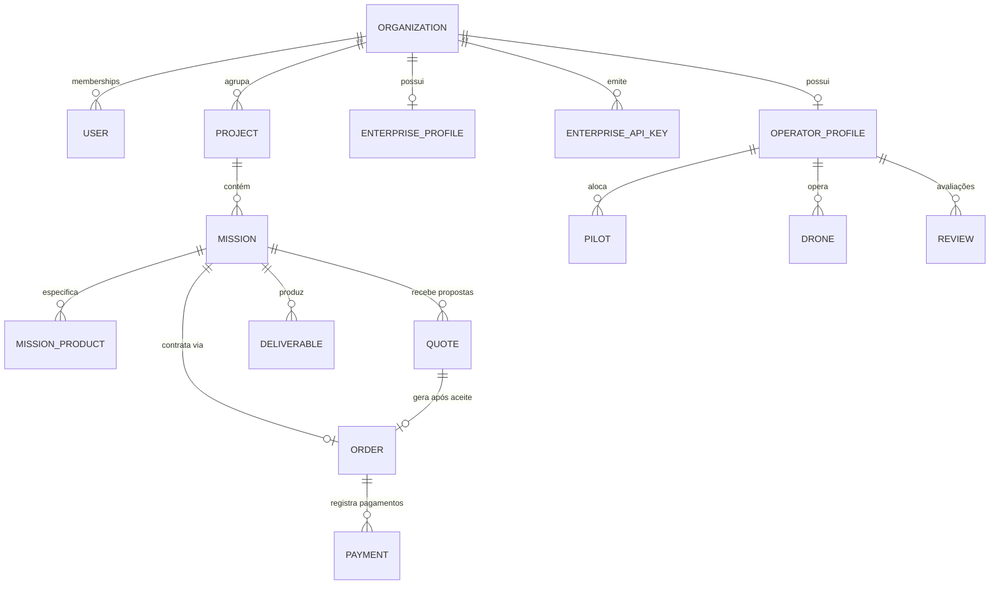

# Phase 5A — OEST Backend Discovery for MCP Platform

> **Relatório Técnico de Auditoria e Descoberta de Infraestrutura**  
> **Data:** 17 de Setembro de 2026  
> **Workspace:** `C:\Users\Bobi\Desktop\drone\dronehub`  
> **Repositório:** DroneHub / OEST Backend  
> **Status:** Discovery & Audit (Sem alterações de código)

---

## 1. Executive Summary

Este documento consolida o mapeamento do backend Rails real da plataforma **DroneHub / OEST**, com foco na futura integração com o **MCP Platform** (Phase 5B).

A auditoria foi conduzida utilizando o MCP `rails-ai-context` como fonte primária de verdade (*Live AST & Schema Introspection*), complementada por inspeção direta de código e testes do repositório.

### Principais Conclusões:
1. **Maturidade da API:** O backend possui rotas RESTful bem estruturadas em `Api::V1` sob o padrão ActionController::API, com isolamento multi-inquilino robusto baseado no módulo `TenantScope` e autorização via `Pundit`.
2. **Dupla Interface de Autenticação:** Suporte nativo tanto para tokens JWT (usuários interativos) quanto para API Keys corporativas (`Enterprises::ApiKey`), com verificação de *scopes* e resolução automática de inquilino.
3. **Prontidão para MCP (Read-Only Tools):** 70% das capacidades de consulta de domínio (Missions, Operators, Quotes, Orders, Deliverables, Subscriptions) já possuem endpoints ou queries ativas e seguras.
4. **Gaps Identificados:** Não existem endpoints para telemetria profunda de Sidekiq (*failed jobs*), saúde de integrações externas nem histórico analítico agregado de chamadas de API Keys. Algumas rotas declaradas em `routes.rb` não possuem controllers implementados (ex: `Api::V1::OrganizationsController`, `Api::V1::WebhooksController`).

---

## 2. Backend Stack

| Componente | Versão / Tecnologia | Detalhes & Configuração |
| :--- | :--- | :--- |
| **Linguagem** | Ruby `>= 3.2.0` (3.2.2) | Executado em modo API-only |
| **Framework** | Rails `8.0.5` | `config.load_defaults 7.2`, `config.api_only = true` |
| **Banco de Dados** | PostgreSQL (`pg 1.6.3`) + PostGIS | 59 tabelas gerenciadas, version `20260917000003` |
| **Servidor HTTP** | Puma `6.6.1` | Configuração padrão de concorrência |
| **Autenticação** | Devise `4.9.4` + Devise-JWT / Custom JWT | HMAC-SHA256 JWT com rotação via `jti` e API Keys |
| **Autorização** | Pundit `2.5.2` | Policies em `app/policies/`, context via `pundit_user` |
| **Fila / Background Jobs**| Sidekiq `7.3.10` + Redis `5.4.1` | `ActiveJob::Base` com adapter Sidekiq |
| **Admin Console** | ActiveAdmin `3.2.1` | DSL de recursos em `app/admin/`, sessões ativadas via middleware |
| **Rate Limiting** | Rack::Attack `6.7.0` | Throttling de auth, endpoints sensíveis e global 300 req/min |
| **Serialização** | Alba (`Alba::Resource`) + DTOs | CamelCase / lowerCamel transform, envelopes `{ data, meta }` |
| **Formato de Erros** | RFC 7807 Problem Details | `{ type, title, status, code, detail, request_id }` |
| **Mapeamento Geoespacial**| GeoJSON / PostGIS | Coordenadas polygon para missões e áreas de voo |
| **Paginação** | Kaminari `1.2.2` / Clamped Limits | Padrão `limit` (max 100) e `offset` |
| **State Machine** | AASM `5.5.2` | Ciclo de vida de missões, quotes, pedidos e entregáveis |
| **Pagamentos / Billing** | Stripe `13.5.1` (Stripe Connect) | Webhooks com validação de assinatura em tempo real |
| **Testes & Análise** | RSpec `6.1.5`, FactoryBot, Brakeman 8.0 | Testes de requests, policies, services e models |

---

## 3. Autenticação, Tenancy e RBAC

### 3.1 Pipeline de Autenticação (`Api::V1::BaseController`)
O pipeline de requisições no `Api::V1::BaseController` executa três `before_action` mandatórios:
1. `:authenticate_user!`
2. `:set_request_id`
3. `:resolve_organization!`

```
                      [ Incoming Request ]
                               │
            ┌──────────────────┴──────────────────┐
            ▼                                     ▼
   [ Header: X-Api-Key ]               [ Header: Authorization ]
   (dh_live_... / dh_test_...)          (Bearer <jwt_token>)
            │                                     │
            ▼                                     ▼
 ┌──────────────────────┐              ┌──────────────────────┐
 │ Enterprises::ApiKey  │              │ Custom JWT Decode    │
 │ HMAC-SHA256 digest   │              │ Secret: JWT_SECRET   │
 │ Prefix match (16 ch) │              │ Validate exp & jti   │
 └──────────┬───────────┘              └──────────┬───────────┘
            │                                     │
            ├─ Org: api_key.organization          ├─ Needs: X-Organization-Id
            ├─ User: api_key.requested_by         ├─ Validate Org Membership
            └─ Scopes: api_key.scopes             └─ Tenant Context Check
```

#### Modos Suportados:
1. **Enterprise API Key:**
   - Prefixos: `dh_live_...` ou `dh_test_...` enviados via `Authorization: Bearer <key>` ou `X-Api-Key: <key>`.
   - Autenticação por prefixo (`first(16)`) e `token_digest` gerado por `HMAC-SHA256(secret_key_base, raw_secret)`.
   - A organização e o usuário criador são resolvidos automaticamente a partir da chave.
   - Atualiza `last_used_at` de forma assíncrona/colunar (`update_column`).
2. **JWT Bearer Token:**
   - Token JWT com claims `sub` (user_id), `jti` (UUID de sessão), `type: "access"`, expiração padrão de 15 minutos.
   - Invalidação imediata de sessão via rotação do `jti` no model `User`.
3. **Dev Auth Fallback:**
   - Ativo apenas se `!Rails.env.production?` E `ENV["ALLOW_DEV_AUTH"] == "true"`, via header `X-User-Id`.

### 3.2 Isolamento Multi-Tenancy (`TenantScope`)
O isolamento de dados é centralizado no módulo `TenantScope` (`backend/lib/tenant_scope.rb`):
- **`TenantScope.resolve(model, organization:)`**: Injeta cláusula `where(organization_id: org.id)` ou `where(customer_organization_id: org.id)`.
- **`TenantScope.find_mission!(id, organization:)`**: Valida se a organização autenticada é o cliente contratante, o operador com pedido associado ou se possui cotação ativa na missão.
- **`TenantScope.find_order!(id, organization:)`**: Garante acesso somente se a organização for o cliente comprador (`customer_organization_id`) ou o prestador (`operator_organization_id`).
- **`TenantScope.find_quote!(id, organization:)`**: Permite acesso apenas para `customer_organization_id` ou `operator_organization_id`.
- **`TenantScope.find_deliverable!(id, organization:)`**: Valida a posse através da cadeia `deliverable -> mission -> order/organization`.

### 3.3 Papéis e Permissões (RBAC)
Os papéis são atribuídos por organização no model `OrganizationMembership`:
- `owner`: Controle total da organização, membros, API keys e faturamento.
- `admin`: Gerenciamento de operações, criação de missões, aceitação de cotações e convites.
- `manager` / `procurement`: Gestão de missões, aprovação de entregáveis e compras.
- `operator_manager`: Submissão de propostas/quotes, gestão de frota e pilotos.
- `pilot`: Visualização operacional de missões atribuídas e uploads de entregáveis.
- `analyst`: Revisão técnica de deliverables e produtos de dados.
- `billing`: Acesso a invoices, faturas e configurações de pagamento.
- `viewer`: Acesso somente leitura a missões e relatórios.

---

## 4. Mapa de Domínios do OEST



### 4.1 Entidades Principais e Schemas

| Domínio | Model / Tabela | Associações Principais | Scopes / Status |
| :--- | :--- | :--- | :--- |
| **Organization** | `Organization`<br>`organizations` | `has_many :organization_memberships`<br>`has_one :operator_profile`<br>`has_one :enterprise_profile`<br>`has_many :enterprise_api_keys` | `active`, `suspended`, `closed`<br>Tipos: `customer`, `drone_operator`, `enterprise`, etc. |
| **Mission** | `Missions::Mission`<br>`missions` | `belongs_to :organization`<br>`belongs_to :project`<br>`has_many :quotes`<br>`has_one :order`<br>`has_many :deliverables` | Status: `draft`, `planning`, `published`, `quoting`, `operator_selected`, `scheduled`, `in_progress`, `processing`, `review`, `completed`, `cancelled`, `disputed` |
| **Operator Profile** | `Operators::OperatorProfile`<br>`operator_profiles` | `belongs_to :organization`<br>`has_many :pilots`<br>`has_many :drones`<br>`has_many :portfolio_items`<br>`has_many :reviews` | `searchable`, `accepting_jobs`<br>Status verificação: `pending`, `verified`, `rejected` |
| **Quote** | `Quotes::Quote`<br>`quotes` | `belongs_to :mission`<br>`belongs_to :customer_organization`<br>`belongs_to :operator_organization` | Status: `draft`, `submitted`, `accepted`, `rejected`, `withdrawn` |
| **Order** | `Orders::Order`<br>`orders` | `belongs_to :mission`<br>`belongs_to :quote`<br>`belongs_to :customer_organization`<br>`belongs_to :operator_organization` | Status: `pending_payment`, `paid`, `in_progress`, `completed`, `cancelled` |
| **Deliverable** | `Deliverables::Deliverable`<br>`deliverables` | `belongs_to :organization`<br>`belongs_to :mission`<br>`belongs_to :data_product`<br>`belongs_to :uploaded_by` | Status: `uploading`, `processing`, `available`, `in_review`, `approved`, `rejected`, `archived` |
| **API Keys** | `Enterprises::ApiKey`<br>`enterprise_api_keys` | `belongs_to :organization`<br>`belongs_to :requested_by`<br>`belongs_to :approved_by` | Status: `requested`, `approved`, `active`, `revoked`, `cancelled`<br>Scopes: `missions:read`, `missions:write`, `orders:read`, `deliverables:read`, `webhooks:read`, `webhooks:write` |
| **Billing & Plans**| `Billing::Plan`<br>`Billing::Subscription`<br>`Billing::Payment` | `belongs_to :organization`<br>`has_many :plan_features` | Planos: `free`, `pro`, `enterprise`<br>Status: `active`, `trialing`, `canceled` |
| **Jobs & Outbox** | `DomainOutboxEvent`<br>`domain_outbox_events` | Desacoplado via eventos de domínio | Eventos assíncronos processados via `OutboxPublisherJob` e Sidekiq |

---

## 5. Auditoria de Capacidades: Shared Tools

Avaliação da prontidão dos endpoints atuais do DroneHub para as ferramentas padrão da plataforma MCP:

| Tool MCP | Status | Rota Rails | Controller & Action | Auth / Policy | Tenant Scoped | Shape do Retorno / Observações |
| :--- | :--- | :--- | :--- | :--- | :--- | :--- |
| `get_system_health` | **PARTIAL** | `GET /health`<br>`(GET /ready)` | `HealthController#show`<br>*(#ready não implementado)* | Nenhuma (Público) | N/A | Retorna `{ status: "ok", service: "dronehub-api", time, version }`. Não realiza checagem profunda de PostgreSQL ou Redis no endpoint atual. |
| `get_integration_health` | **MISSING** | *(Nenhuma)* | *(Inexistente)* | N/A | N/A | Não há endpoint unificado para status de conectividade do Stripe Connect e AWS S3 Presigner. |
| `get_subscription_summary` | **EXISTS** | `GET /api/v1/billing/plan` | `Api::V1::Billing::SubscriptionsController#show` | `authenticate_user!`<br>`resolve_organization!` | Sim (`current_organization`) | Retorna `subscription_id`, `status`, `plan: { id, slug, name }`, e snapshot completo de entitlements via `Entitlements::Resolver.snapshot`. |
| `get_usage_summary` | **PARTIAL** | `GET /api/v1/billing/usage` | `Api::V1::Billing::UsageController#show` | `authenticate_user!`<br>`resolve_organization!` | Sim (`current_organization`) | Retorna `{ organization_id, missions_count, period: "YYYY-MM" }`. Falta detalhamento de bytes armazenados, volume de voos e métricas de API. |
| `get_failed_webhooks` | **MISSING** | *(Nenhuma)* | *(Inexistente)* | N/A | N/A | A aplicação processa webhooks Stripe recebidos (`Api::V1::Webhooks::StripeController`), mas não expõe histórico ou falhas de disparos externos para inquilinos. |
| `get_api_key_usage` | **PARTIAL** | `GET /api/v1/enterprise/api_keys` | `Api::V1::Enterprise::ApiKeysController#index` | `authenticate_user!`<br>`require_enterprise_manager!` | Sim (`current_organization`) | Lista chaves da organização com timestamp `last_used_at`, `prefix`, `status` e `scopes`. Falta log agregado de taxa de requisições por chave. |

---

## 6. Auditoria de Capacidades: OEST Domain Tools

Avaliação do suporte nativo para as operações de domínio especializadas do OEST:

| Tool MCP | Status | Rota Rails | Controller & Action | Auth & Policy | Tenant Scoped | Shape do Retorno / Observações |
| :--- | :--- | :--- | :--- | :--- | :--- | :--- |
| `get_organization_summary` | **EXISTS** | `GET /api/v1/enterprise/dashboard`<br>`GET /api/v1/operator/dashboard` | `Api::V1::Enterprise::DashboardController#show`<br>`Api::V1::Operator::DashboardController#show` | `authenticate_user!`<br>`require_tenant_context!` | Sim (`current_organization`) | Retorna dados cadastrais, percentual de completude do perfil, contadores de missões por status e notificações recentes. |
| `list_missions` | **EXISTS** | `GET /api/v1/missions`<br>`GET /api/v1/enterprise/orders` | `Api::V1::MissionsController#index`<br>`Api::V1::Enterprise::OrdersController#index` | `authenticate_user!`<br>`Missions::MissionPolicy` | Sim (`policy_scope`) | Lista missões com paginação (`limit`, `offset`), filtros de status, tipo de missão, área em hectares e prazos. |
| `get_mission` | **EXISTS** | `GET /api/v1/missions/:id`<br>`GET /api/v1/enterprise/orders/:id` | `Api::V1::MissionsController#show`<br>`Api::V1::Enterprise::OrdersController#show` | `authenticate_user!`<br>`Missions::MissionPolicy#show?` | Sim (`TenantScope.find_mission!`) | Retorna DTO detalhado via `Missions::WorkspaceQuery`: geometria GeoJSON, produtos de dados, cotações recebidas, pedido vinculado e status. |
| `get_mission_summary` | **PARTIAL** | `GET /api/v1/missions/:id` | `Api::V1::MissionsController#show` | `authenticate_user!`<br>`Missions::MissionPolicy` | Sim (`TenantScope`) | Dados resumidos embutidos no workspace da missão e nos contadores do dashboard. Endpoint exclusivo de sumarização não existe isoladamente. |
| `list_operators` | **EXISTS** | `GET /api/v1/marketplace/operators` | `Api::V1::Marketplace::OperatorsController#index` | Público / `skip_before_action` | N/A (Marketplace Público) | Filtros por `min_rating`, `service` (categoria), `state` (UF). Retorna cards de operadores verificados com avaliações médias e logo. |
| `get_operator_summary` | **EXISTS** | `GET /api/v1/marketplace/operators/:slug` | `Api::V1::Marketplace::OperatorsController#show` | Público / `Marketplace::OperatorProfileQuery` | N/A (Marketplace Público) | Retorna perfil completo, frotas, histórico de avaliações, áreas de cobertura e categorias atendidas. |
| `get_quote_summary` | **EXISTS** | `GET /api/v1/missions/:mission_id/quote-comparison` | `Api::V1::QuotesController#comparison` | `authenticate_user!`<br>`Quotes::ComparisonQuery` | Sim (`TenantScope.find!`) | Retorna comparação lado a lado de todas as propostas da missão: preços, prazos estimados, taxas da plataforma e reputação do operador. |
| `get_order_summary` | **EXISTS** | `GET /api/v1/orders/:id` | `Api::V1::OrdersController#show` | `authenticate_user!`<br>`Orders::OrderPolicy#show?` | Sim (`TenantScope.find_order!`) | Retorna pedido financeiro, status de pagamento, valores discriminados (subtotal, marketplace_fee, operator_amount) e datas de aceite. |
| `get_deliverable_summary` | **EXISTS** | `GET /api/v1/missions/:mission_id/deliverables`<br>`GET /api/v1/enterprise/orders/:id/delivery` | `Api::V1::DeliverablesController#index`<br>`Api::V1::Enterprise::OrdersController#delivery` | `authenticate_user!`<br>`Deliverables::DeliverablePolicy` | Sim (`TenantScope.find_mission!`) | Lista arquivos gerados (ortomosaicos, nuvens de pontos, DSM), status de aprovação, tamanhos, hashes SHA-256 e URLs para download. |
| `get_failed_jobs` | **MISSING** | *(Nenhuma)* | *(Inexistente)* | N/A | N/A | Não há rota na API REST para inspecionar filas de retry / dead jobs do Sidekiq. |

---

## 7. Security Review & Vulnerability Findings

### 7.1 Classificação dos Endpoints Atuais

| Endpoint / Componente | Classificação | Avaliação de Risco & Justificativa |
| :--- | :--- | :--- |
| `GET /api/v1/missions` & `show` | **SAFE** | `TenantScope.find_mission!` e Pundit garantem estrita separação entre organizações. |
| `GET /api/v1/enterprise/orders` & `show` | **SAFE** | Escopo filtrado por `organization_id: current_organization.id`, validação de `scopes: ["orders:read"]`. |
| `GET /api/v1/quotes/:id` & `comparison` | **SAFE** | `TenantScope.find_quote!` e `Quotes::ComparisonQuery` barram inquilinos não autorizados. |
| `GET /api/v1/deliverables` & `download_url` | **SAFE** | Verificação dupla de posse e URLs pré-assinadas com expiração temporária. |
| `GET /api/v1/enterprise/api_keys` | **SAFE** | Secrets brutos nunca são persistidos ou serializados (apenas prefixo e status). |
| `GET /api/v1/marketplace/*` | **SAFE** | Apenas dados públicos, verificados e marcados como `searchable: true` são expostos. |
| `GET /api/v1/billing/*` | **SAFE** | Isolamento por organização autenticada. |
| `Api::V1::Operator::MissionsController` | **REQUIRES_HARDENING** | Utiliza consulta em coluna inexistente (`operator_organization_id` na tabela `missions`). |
| `Billing::PaymentPolicy::Scope` | **REQUIRES_HARDENING** | Referencia `user.organization` em vez de `context.organization`, o que pode causar falha de resolução em chamadas Pundit diretas. |
| `GET /ready` | **REQUIRES_HARDENING** | Rota definida no `routes.rb` apontando para action `#ready` não declarada no `HealthController`. |
| `Api::V1::OrganizationsController` | **MISSING** | Rota declarada em `routes.rb` sem controller correspondente implementado. |

### 7.2 Checklist de Segurança

- [x] **Cross-Tenant Isolation:** Implementado via `TenantScope` em todos os endpoints sensíveis de clientes e operadores.
- [x] **Sem Exposição de Chaves:** O hash das API Keys usa `OpenSSL::HMAC.hexdigest("SHA256", secret_key_base, secret)`. O segredo é emitido apenas uma vez no método `activate!`.
- [x] **Filtragem de Parâmetros Sensíveis:** `filter_parameter_logging.rb` amortece tokens, passwords, CPFs e referências bancárias dos logs.
- [x] **Proteção de Atributos Internos:** `ApplicationRecord::SENSITIVE_ATTRIBUTES` bloqueia colunas críticas de buscas arbitrárias via Ransack.
- [x] **Autorização em Camada Dupla:** `BaseController` valida membership e contexto de tenant (`require_tenant_context!`), complementado por Pundit Policies para ações atômicas.

---

## 8. Mapa de Contrato MCP (Phase 5B Preparation)

| MCP Tool Name | Capability | Status Atual | Existing Endpoint | Autenticação Requerida | Tenant Scoped | Policy / Guard | Safe for MCP | Gap a Resolver na Phase 5B |
| :--- | :--- | :--- | :--- | :--- | :--- | :--- | :---: | :--- |
| `get_system_health` | System Health | **PARTIAL** | `GET /health` | Nenhuma | Não | N/A | **SIM** | Adicionar checagem de DB/Redis e implementar `health#ready`. |
| `get_integration_health` | Integrations Health | **MISSING** | *(Nenhum)* | Admin / Sys | Não | Admin / Sys | **NÃO** | Criar endpoint interno de health check de terceiros (Stripe / S3). |
| `get_subscription_summary` | Subscriptions | **EXISTS** | `GET /api/v1/billing/plan` | Bearer / API Key | Sim | Entitlements Guard | **SIM** | Pronto para consumo. |
| `get_usage_summary` | Usage & Quotas | **PARTIAL** | `GET /api/v1/billing/usage` | Bearer / API Key | Sim | Organization Guard | **SIM** | Expandir DTO com métricas de armazenamento e chamadas de API. |
| `get_api_key_usage` | API Key Analytics | **PARTIAL** | `GET /api/v1/enterprise/api_keys` | Bearer / API Key | Sim | `require_enterprise_manager!` | **SIM** | Criar agregação de requisições por API Key se métricas forem necessárias. |
| `get_failed_webhooks` | Webhook Monitoring | **MISSING** | *(Nenhum)* | Admin / Sys | Sim | Admin Policy | **NÃO** | Criar endpoint de inspeção do outbox/webhooks com falha. |
| `get_organization_summary` | Org Dashboard | **EXISTS** | `GET /api/v1/enterprise/dashboard` | Bearer / API Key | Sim | Tenant Context | **SIM** | Pronto para consumo. |
| `list_missions` | Missions Directory | **EXISTS** | `GET /api/v1/missions` | Bearer / API Key | Sim | `Missions::MissionPolicy::Scope` | **SIM** | Pronto para consumo. |
| `get_mission` | Mission Details | **EXISTS** | `GET /api/v1/missions/:id` | Bearer / API Key | Sim | `Missions::MissionPolicy#show?` | **SIM** | Pronto para consumo via `Missions::WorkspaceQuery`. |
| `list_operators` | Operator Directory | **EXISTS** | `GET /api/v1/marketplace/operators` | Público | Não | Searchable Scope | **SIM** | Pronto para consumo. |
| `get_operator_summary` | Operator Profile | **EXISTS** | `GET /api/v1/marketplace/operators/:slug` | Público | Não | Profile Query | **SIM** | Pronto para consumo. |
| `get_quote_summary` | Quotes Comparison | **EXISTS** | `GET /api/v1/missions/:id/quote-comparison` | Bearer / API Key | Sim | `TenantScope.find!` | **SIM** | Pronto para consumo via `Quotes::ComparisonQuery`. |
| `get_order_summary` | Order Details | **EXISTS** | `GET /api/v1/orders/:id` | Bearer / API Key | Sim | `Orders::OrderPolicy#show?` | **SIM** | Pronto para consumo. |
| `get_deliverable_summary` | Deliverables List | **EXISTS** | `GET /api/v1/missions/:id/deliverables` | Bearer / API Key | Sim | `TenantScope.find_mission!` | **SIM** | Pronto para consumo. |
| `get_failed_jobs` | Background Jobs | **MISSING** | *(Nenhum)* | Admin / Platform | Não | `AdminAuthorization` | **NÃO** | Implementar endpoint seguro sob `/api/v1/admin/jobs/failed`. |

---

## 9. Seção PROPOSED ONLY (Endpoints Sugeridos para o Futuro)

> [!NOTE]
> Os endpoints abaixo **NÃO EXISTEM** no backend atual. Eles são especificações propostas para suportar 100% das ferramentas do MCP Platform durante a Phase 5B ou fases posteriores.

### Proposta A: Health Check Aprofundado
- **Rota Proposta:** `GET /ready` ou `GET /api/v1/system/health`
- **Controller Proposto:** `HealthController#ready`
- **Contrato Sugerido:**
```json
{
  "status": "ready",
  "checks": {
    "database": "connected",
    "redis": "connected",
    "sidekiq_queue_latency_ms": 45
  },
  "timestamp": "2026-09-17T14:35:00Z"
}
```

### Proposta B: Telemetria de Jobs para MCP
- **Rota Proposta:** `GET /api/v1/admin/jobs/failed`
- **Controller Proposto:** `Api::V1::Admin::JobsController#failed`
- **Autorização Proposta:** `before_action :require_platform_admin!`
- **Contrato Sugerido:**
```json
{
  "data": [
    {
      "job_id": "8f8b89e2-9d32-4e0a-9d91-cb3513a02bb4",
      "class": "Matching::RunForMissionJob",
      "queue": "default",
      "failed_at": "2026-09-17T14:00:00Z",
      "error_class": "Net::OpenTimeout",
      "error_message": "execution expired",
      "retry_count": 3
    }
  ],
  "meta": { "dead_count": 0, "retry_count": 1 }
}
```

### Proposta C: Status Unificado de Integrações
- **Rota Proposta:** `GET /api/v1/admin/integrations/health`
- **Controller Proposto:** `Api::V1::Admin::IntegrationsController#show`
- **Contrato Sugerido:**
```json
{
  "data": {
    "stripe": { "status": "configured", "webhook_configured": true },
    "storage": { "provider": "s3", "bucket": "dronehub-deliverables", "presigner": "ready" },
    "mail": { "adapter": "smtp", "status": "operational" }
  }
}
```

---

## 10. Implementation Blockers & Findings

1. **Inconsistência em `Operator::MissionsController`:**  
   As queries `Missions::Mission.where(operator_organization_id: ...)` no controller do operador precisam ser corrigidas para navegar via associação com `orders` ou `quotes`, pois a coluna `operator_organization_id` não reside na tabela `missions`.
2. **Definições de Rotas sem Controller Implementado:**  
   `Api::V1::OrganizationsController`, `Api::V1::MembershipsController`, `Api::V1::InvitationsController`, `Api::V1::WebhooksController` constam em `routes.rb` mas não possuem arquivos físicos em `app/controllers/api/v1/`. Caso uma tool do MCP tente acioná-los, o Rails responderá com erro de constante não inicializada.
3. **Ausência de API para Sidekiq / Background Jobs:**  
   Não há interface REST para checagem de filas de jobs com falha.

---

## 11. GO / NO-GO para Phase 5B

### Veredito: **GO (com restrições de escopo)**

#### Justificativa:
- O ecossistema principal de missões, cotações, frotas de operadores, entregáveis, pedidos e autenticação está **100% descoberto, estável e pronto** para o desenvolvimento de conectores MCP na Phase 5B.
- As ferramentas de domínio (`list_missions`, `get_mission`, `list_operators`, `get_quote_summary`, `get_order_summary`, `get_deliverable_summary`, `get_organization_summary`) podem ser construídas imediatamente apontando para os endpoints existentes.
- As capacidades marcadas como `MISSING` (`get_failed_jobs`, `get_integration_health`) deverão ter seus contratos mockados ou implementados em task de backend dedicada antes de serem ativadas no MCP Platform.
