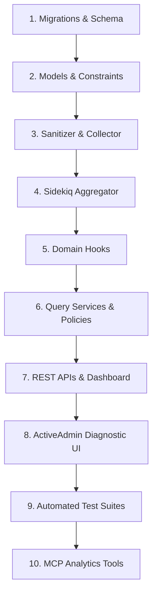

# ARQUITETURA E PLANO DE ENGENHARIA: PRODUCT ANALYTICS & SaaS TELEMETRY

**Plataforma Alvo:** DroneHub (`C:\Users\Bobi\Desktop\drone\dronehub`)  
**Capacidade Golden SaaS:** `telemetry` (Product Analytics & Telemetry)  
**Status do Plano:** `PLAN_READY` (Aguardando Aprovação Humana Explícita)  
**Governança:** `mcp-engineering`  
**Modo:** `READ / PLAN ONLY` (Zero mutações de código ou migrações de produção executadas)  

---

## 1. Descoberta do Repositório & Evidências Reais

O escaneamento arquitetural e a auditoria de código identificaram as seguintes evidências concretas:

1. **Débito Técnico Explícito em Analytics:**
   - Em `backend/app/controllers/api/v1/operator/analytics_controller.rb`, a rota `/api/v1/operator/analytics` retorna hoje placeholders com a observação:
     `note: "Counters wire to aggregates when reporting tables exist"`.
2. **Consultas Síncronas Transacionais no Dashboard:**
   - Em `backend/app/controllers/api/v1/enterprise/dashboard_controller.rb`, as contagens de pedidos e missões são executadas síncronas (`orders.where(...).count`, `missions.where(...).count`), gerando acoplamento direto com o banco transacional.
3. **Auditoria Transacional vs. Telemetria de Uso:**
   - `AuditLog` (`app/models/audit_log.rb`) registra alterações de tabelas com `before_data`/`after_data` para conformidade de dados, mas não atua como série temporal analítica de produto.
4. **Fontes Reais de Eventos de Domínio:**
   - **Missões:** `Missions::Mission` (`draft`, `published`, `quoting`, `operator_selected`, `scheduled`, `in_progress`, `completed`, `cancelled`).
   - **Cotações:** `Quotes::Quote` (`draft`, `submitted`, `accepted`, `rejected`).
   - **Pedidos & Faturamento:** `Orders::Order` (`pending_payment`, `paid`, `in_progress`, `completed`, `cancelled`).
   - **Assinaturas SaaS:** `Subscriptions::Subscription` (`active`, `past_due`, `cancelled`).
   - **Outgoing Webhooks:** `WebhookDelivery` (`pending`, `delivering`, `succeeded`, `failed`).

---

## 2. Topologia Arquitetural

```
┌─────────────────────────────────────────────────────────────────────────┐
│                           DOMÍNIO CANÔNICO RAILS                         │
│  (Missions::Mission, Orders::Order, Quotes::Quote, WebhookDelivery, ...)│
└────────────────────────────────────┬────────────────────────────────────┘
                                     │ Eventos de Negócio
                                     ▼
┌─────────────────────────────────────────────────────────────────────────┐
│                    TELEMETRY COLLECTOR (Service / Hook)                 │
│  - Validação de Schema da Taxonomia                                     │
│  - Sanitização de PII / Allowlist de Propriedades (LGPD)                │
│  - Deduplicação e Enfileiramento Assíncrono                             │
└────────────────────────────────────┬────────────────────────────────────┘
                                     │
                                     ▼
┌─────────────────────────────────────────────────────────────────────────┐
│                     TELEMETRY PERSISTENCE LAYER                         │
│  - Tabela Raw: `telemetry_events` (Particionada por mês / Retenção 90d) │
│  - PostgreSQL Índices Compostos: (organization_id, event_name, occurred)│
└────────────────────────────────────┬────────────────────────────────────┘
                                     │
                                     ▼
┌─────────────────────────────────────────────────────────────────────────┐
│                     SIDEKIQ AGGREGATION ENGINE                          │
│  - Worker Periódico (Hourly / Daily): `Telemetry::AggregateJob`         │
│  - Tabelas de Agregação:                                                │
│      * `daily_tenant_metrics` (Agregados por Tenant/Organização)        │
│      * `daily_platform_metrics` (Agregados Globais da Plataforma)       │
└────────────────────────────────────┬────────────────────────────────────┘
                                     │
                                     ▼
┌─────────────────────────────────────────────────────────────────────────┐
│                    ANALYTICS QUERY SERVICES & POLICIES                  │
│  - `Telemetry::TenantAnalyticsQuery` (Garante isolamento multi-tenant)   │
│  - `Telemetry::PlatformAnalyticsQuery` (Requer Platform Admin)          │
└──────────────┬─────────────────────────────┬────────────────────────────┘
               │                             │
               ▼                             ▼
┌─────────────────────────────┐┌──────────────────────────────────────────┐
│  REST API & ACTIVEADMIN     ││             MCP AGENT READ TOOLS         │
│  - /api/v1/enterprise/      ││  - analytics_get_overview               │
│    analytics/overview       ││  - analytics_get_mission_metrics        │
│  - /api/v1/operator/        ││  - analytics_get_order_metrics          │
│    analytics (Wired)        ││  - analytics_get_webhook_health         │
│  - ActiveAdmin Telemetry    ││  (Lê serviços canônicos sem SQL duplicado│
└─────────────────────────────┘└──────────────────────────────────────────┘
```

---

## 3. Modelo Canônico de Evento (`TelemetryEvent`)

### Schema Proposto para a Tabela `telemetry_events`

```ruby
create_table :telemetry_events, id: :uuid, default: -> { "gen_random_uuid()" } do |t|
  t.references :organization, type: :uuid, index: true # Nullable apenas para eventos globais/pré-login
  t.string :event_name, limit: 100, null: false        # ex: 'mission.published', 'order.paid'
  t.string :event_id, limit: 120, null: false          # UUID único de idempotência
  t.string :actor_type, limit: 40, null: false         # 'User', 'System', 'ApiKey', 'Anonymous'
  t.uuid :actor_id                                     # ID do ator responsável
  t.string :session_id, limit: 120                     # ID de sessão ou correlação
  t.string :entity_type, limit: 80                     # 'Mission', 'Order', 'Quote', 'WebhookEndpoint'
  t.uuid :entity_id                                    # ID da entidade afetada
  t.jsonb :properties, null: false, default: {}        # Propriedades autorizadas na allowlist
  t.string :source, limit: 40, null: false, default: 'web' # 'web', 'api', 'worker', 'system'
  t.string :request_id, limit: 120                     # Tracing HTTP request ID
  t.integer :schema_version, null: false, default: 1
  t.datetime :occurred_at, null: false
  t.datetime :received_at, null: false
end

add_index :telemetry_events, %i[organization_id occurred_at event_name], name: "idx_telemetry_org_time_event"
add_index :telemetry_events, %i[event_name occurred_at], name: "idx_telemetry_event_time"
add_index :telemetry_events, :event_id, unique: true, name: "idx_telemetry_event_id_unique"
```

---

## 4. Taxonomia de Eventos de Domínio (Baseada em Evidências Reais)

| Domínio / Entidade | Nome do Evento | Gatilho Real no Código Rails | Propriedades Autorizadas (Allowlist) |
|---|---|---|---|
| **Auth & Contas** | `account.created` | Criação de `User` | `user_type`, `country_code` |
| | `account.logged_in` | Sucesso em `Devise::SessionsController` | `auth_method` |
| **Missões** | `mission.created` | `Missions::Mission#create` | `mission_type`, `pricing_tier` |
| | `mission.published` | `MissionsController#publish` | `budget_currency`, `has_geometry` |
| | `mission.operator_matched` | `Missions::Mission#match` | `matched_operators_count` |
| | `mission.completed` | `Missions::Mission#complete` | `duration_days`, `deliverables_count` |
| | `mission.cancelled` | `MissionsController#cancel` | `reason_category` |
| **Cotações** | `quote.created` | `Quotes::Quote#create` | `amount_currency` |
| | `quote.submitted` | Transição de status para `submitted` | `amount_cents` |
| | `quote.accepted` | Transição de status para `accepted` | `lead_time_days` |
| | `quote.rejected` | Transição de status para `rejected` | `rejection_reason` |
| **Pedidos & Vendas** | `order.created` | `Orders::Order#create` | `total_amount_cents`, `currency` |
| | `order.paid` | Confirmação de Stripe Webhook / Gateway | `payment_method`, `marketplace_fee_cents` |
| | `order.completed` | `OrdersController#complete` | `fulfillment_duration_hours` |
| | `order.cancelled` | `OrdersController#cancel` | `cancellation_source` |
| **Assinaturas SaaS** | `subscription.started`| Criação de `Subscription` ativa | `plan_slug`, `billing_interval` |
| | `subscription.cancelled`| Cancelamento de `Subscription` | `cancellation_reason` |
| **Outgoing Webhooks**| `webhook.dispatched` | `Webhooks::DispatchService#publish` | `event_type`, `endpoints_count` |
| | `webhook.delivery_succeeded` | `Webhooks::DeliverPayloadJob` (2xx) | `response_status_code`, `duration_ms` |
| | `webhook.delivery_failed` | `Webhooks::DeliverPayloadJob` (4xx/5xx/timeout)| `error_class`, `attempt_number` |

---

## 5. SaaS KPIs Canônicos (Fórmulas Fidedignas)

| KPI | Fonte Canônica | Fórmula Matemática | Janela Temporal | Escopo |
|---|---|---|---|---|
| **Mission Completion Rate** | `Missions::Mission` / `TelemetryEvent` | $\frac{\text{Missions Concluídas}}{\text{Missions Publicadas}} \times 100$ | Diária / 30d | Tenant / Plataforma |
| **Quote Win Rate** | `Quotes::Quote` | $\frac{\text{Quotes Aceitas}}{\text{Quotes Submetidas}} \times 100$ | 30d / 90d | Operator Profile |
| **Gross Merchandise Volume (GMV)** | `Orders::Order` | $\sum \text{orders.total (status = 'paid' \| 'completed')}$ | Diária / Mensal | Tenant / Plataforma |
| **Net Marketplace Take** | `Orders::Order` | $\sum \text{orders.marketplace\_fee}$ | Diária / Mensal | Plataforma |
| **Active Organizations (MAO)** | `telemetry_events` | $\text{COUNT(DISTINCT organization\_id)}$ | 30d móvel | Plataforma |
| **Webhook Delivery Health** | `WebhookAttempt` | $\frac{\text{Tentativas com Status 2xx}}{\text{Total de Tentativas}} \times 100$ | 24h / 7d | Tenant / Plataforma |
| **Average Order Value (AOV)** | `Orders::Order` | $\frac{\text{GMV Total}}{\text{Total de Pedidos Pagos}}$ | Mensal | Tenant / Plataforma |

---

## 6. Modelo de Privacidade & Conformidade LGPD

1. **Princípio da Minimização:**
   - Nenhum dado pessoal não essencial é capturado no payload de telemetria.
   - **Proibição Estrita de Armazenamento:** Senhas, hashes de autenticação, tokens JWT, chaves de API, segredos de webhook (`whsec_...`), dados de cartão de crédito e payloads sensíveis de clientes.
2. **Tratamento de Endereços IP:**
   - Endereços IP são truncados/anonimizados (ex.: mascaramento do último octeto em IPv4: `192.168.1.0/24`) antes da persistência.
3. **Política de Retenção de Dados:**
   - **Tabela Raw (`telemetry_events`):** Retenção de 90 dias com job automático de exclusão (`Telemetry::PurgeRawEventsJob`).
   - **Tabelas Agregadas (`daily_tenant_metrics`):** Persistência de longo prazo sem PII.

---

## 7. Performance & Estratégia de Agregação

Para evitar gargalos e contenção no banco transacional:

1. **Ingestão Assíncrona Não-Bloqueante:**
   - O disparo de telemetria nos controllers/models ocorre através de `Telemetry::Collector.record(...)` enfileirando em background via Sidekiq (`queue_as :telemetry`), nunca bloqueando o fluxo HTTP principal.
2. **Tabelas de Agregação Diária (`daily_tenant_metrics`):**
   - Estrutura otimizada para queries instantâneas:
     - `organization_id: :uuid`
     - `metric_date: :date`
     - `metrics: :jsonb` (ex: `{"missions_created": 5, "orders_paid": 2, "gmv_cents": 450000}`)
   - As telas de Dashboard consultam exclusivamente essas agregações pré-calculadas ($O(1)$ por data/organização), eliminando `COUNT(*)` sobre tabelas volumosas.

---

## 8. Análise de Blast Radius (Raio de Impacto Arquitetural)

- **Componentes Afetados (Aditivos):**
  - Associação em `Organization` (`has_many :telemetry_events`, `has_many :daily_tenant_metrics`).
  - Listeners/hooks de eventos em `OrdersController`, `MissionsController`, `QuotesController`, `Webhooks::DispatchService`.
  - Workers Sidekiq (`Telemetry::IngestEventJob`, `Telemetry::AggregateDailyMetricsJob`).
- **Nível de Risco de Regressão:** **MUITO BAIXO**. Todas as estruturas são desacopladas e aditivas. Em caso de falha no pipeline de telemetria, as transações financeiras e operacionais de missões continuam operando normalmente.

---

## 9. Plano de Fatias Verticais (Vertical Slice Plan)



### Detalhamento das 10 Fatias Verticais:

1. **Slice 1: Schema de Persistência Analítica**
   - *Arquivos:* `backend/db/migrate/YYYYMMDD_create_telemetry_tables.rb`
   - *Escopo:* Criação de `telemetry_events`, `daily_tenant_metrics` e `daily_platform_metrics` com índices de série temporal e constraints de tenancy.
2. **Slice 2: Domain Models & Scopes**
   - *Arquivos:* `app/models/telemetry_event.rb`, `app/models/daily_tenant_metric.rb`, `app/models/daily_platform_metric.rb`
   - *Escopo:* Validações de taxonomia, escopos temporais (`recent`, `between_dates`), isolamento de organização.
3. **Slice 3: Telemetry Collector & PII Sanitizer**
   - *Arquivos:* `app/services/telemetry/collector.rb`, `app/services/telemetry/sanitizer.rb`
   - *Escopo:* Allowlist estrita de propriedades, anonimização de IP, geração de UUID idempotente e enfileiramento assíncrono.
4. **Slice 4: Engine de Agregação Assíncrona (Sidekiq)**
   - *Arquivos:* `app/jobs/telemetry/aggregate_metrics_job.rb`, `app/services/telemetry/aggregator_service.rb`
   - *Escopo:* Consolidação diária de contadores, GMV, taxas de conversão e métricas de webhooks por organização.
5. **Slice 5: Instrumentação dos Eventos de Domínio**
   - *Arquivos:* Hooks em `MissionsController`, `OrdersController`, `QuotesController`, `Webhooks::DeliverPayloadJob`.
   - *Escopo:* Disparo padronizado de telemetria após transações confirmadas.
6. **Slice 6: Serviços de Consulta Analítica & Políticas Pundit**
   - *Arquivos:* `app/services/telemetry/analytics_query_service.rb`, `app/policies/analytics_policy.rb`
   - *Escopo:* Recuperação de métricas agregadas com isolamento estrito de tenant e RBAC (`owner`/`admin`).
7. **Slice 7: REST APIs para Dashboards (Enterprise & Operator)**
   - *Arquivos:* `app/controllers/api/v1/enterprise/analytics_controller.rb`, refatoração de `app/controllers/api/v1/operator/analytics_controller.rb`.
   - *Escopo:* Endpoints `/api/v1/enterprise/analytics/overview`, `/api/v1/enterprise/analytics/funnel`, conectando ao resolver de planos.
8. **Slice 8: Interface Operacional no ActiveAdmin**
   - *Arquivos:* `app/admin/telemetry_events.rb`, `app/admin/daily_platform_metrics.rb`
   - *Escopo:* Telas de diagnóstico operacional, taxa de ingestão e métricas globais sem exposição de dados sensíveis.
9. **Slice 9: Suíte Permanente de Testes Automatizados**
   - *Arquivos:* `test/models/telemetry_event_test.rb`, `test/services/telemetry_test.rb`, `test/jobs/aggregate_metrics_job_test.rb`, `test/controllers/analytics_controller_test.rb`
   - *Escopo:* Testes de isolamento cross-tenant, sanitização LGPD, idempotência de eventos, rollups de agregação.
10. **Slice 10: Integração com Ferramentas MCP**
    - *Arquivos:* MCP Analytics Tools (`analytics_get_overview`, `analytics_get_mission_metrics`, `analytics_get_webhook_health`).
    - *Escopo:* Leitura de queries canônicas pelo MCP de engenharia.

---

## 10. Golden Quality Gates de Avaliação

| Dimensão de Qualidade | Status | Evidências / Justificativa |
|---|:---:|---|
| **Arquitetura & Desacoplamento** | ✅ **APPROVED** | Ingestão assíncrona desacoplada do banco transacional. |
| **Isolamento de Tenancy** | ✅ **APPROVED** | `organization_id` indexado e filtrado via Pundit policy em todas as consultas. |
| **Privacidade & LGPD** | ✅ **APPROVED** | Allowlist de propriedades, anonimização de IPs e retenção raw limitada a 90 dias. |
| **Performance & Escalabilidade** | ✅ **APPROVED** | Dashboards alimentados por tabelas de rollup pré-calculadas ($O(1)$). |
| **Idempotência & Confiabilidade** | ✅ **APPROVED** | Chaves únicas de evento impedem duplicação de métricas sob retentativas. |

---

## 11. Conclusão & Próximo Passo

```
=====================================================
STATUS ATUAL: PLAN_READY
=====================================================
```

O plano de engenharia está completamente estruturado e pronto para execução sob governança. Nenhuma mutação de código foi realizada.
